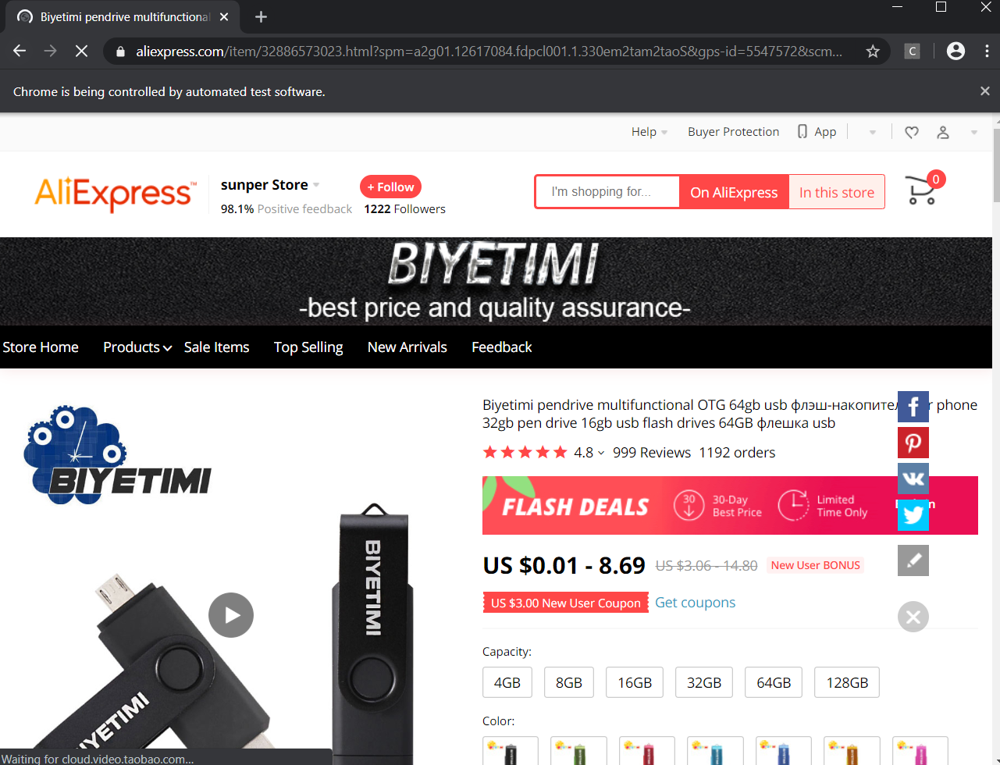
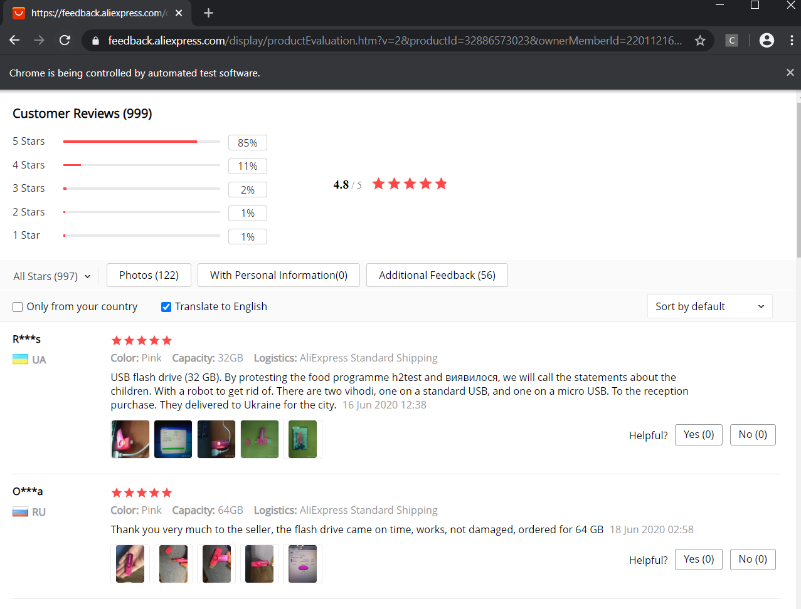
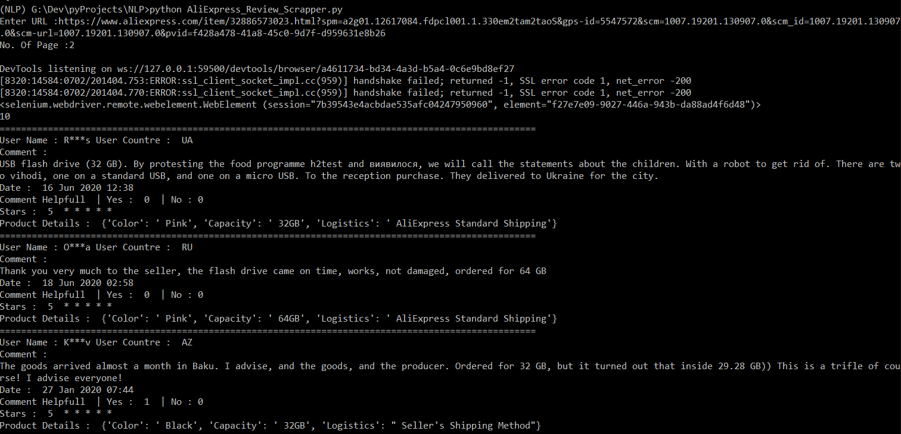
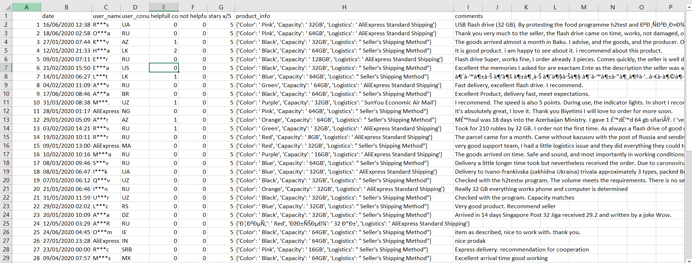

# AliExpressCrawler-FetchUserReview
This Repo Contains AliExpress Crawler Which Fetches The User Reviews From Given URL and Gives You a CSV file of the Data Fetched
## Requirements
* Python 3 [ https://www.python.org/downloads/ ]
* Selenium
* Web Driver For Appropriate Web Browser
* pandas to store data
## Steps To Follow
##### Step 1 - Install Selenium [ !pip install selenium ]
##### Step 2 - Setup WebDrivers [ https://selenium-python.readthedocs.io/installation.html ] 
* I Used Google Chrome https://sites.google.com/a/chromium.org/chromedriver/downloads  Version = [ 83.0.4103.39 ]
* Don't Forget to set Environment Variable for Web Driver
##### Step 3 - Install pandas [ !pip install pandas ]

## How To Run ?
* Python AliExpress_Review_Scrapper.py
* It will ask for Url. Enter Url of Product you want to fetch reviews from
* then it will ask for pages. Enter no of pages you want reviews. per page 10 Reviews
* make sure url is valid and it has user reviews available. [ if Reviews = 0 then it will not work obviously :)]
### Screen Shots

## Hope You Like It...!
# Thanks For Visiting
